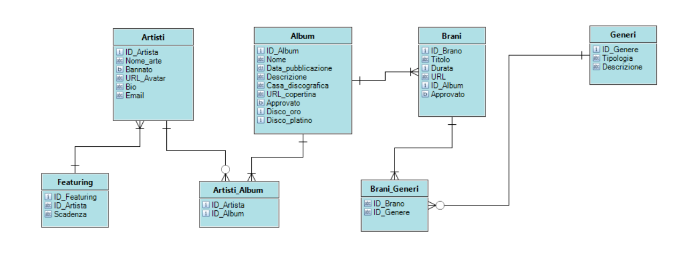

# D&BM

Applicazione creata con lo scopo di semplificare e rendere più immediata la gestione generale di una casa discografica.

Nel backend è presente un mockup automatico per la creazione di dati di prova.

È possibile importare la configurazione di keycloak mettendo il contenuto della cartella "volumi" all'interno di \\wsl$\docker-desktop-data\version-pack-data\community\docker\volumes , ammesso che tu stia usando WSL per la dockerizzazione.
NB: La registrazione potrebbe non funzionare in base all'umore di KeyCloak dopo l'importazione del volume

L'upload dei file è programmato per funzionare su AWS, ho tolto le credenziali e sostituito le chiamate al metodo con un link fisso per evitar problemi, quindi se scoppia qualcosa probabilmente è per quello.

Credenziali di amministrazione: admin@dbm.it:admin
Credenziali di un utente di prova: artista1@dbm.it:artista1

# Progettazione funzionale

Visione Utente: unutente potrà consultare artisti, brani e album nella sua Home Page con la possibilità di ascoltare musica nella maggior semplicità possibile.

Visione Artista: un artista potrà visualizzare nella sua dashboard dedicata i suoi album e canzoni, con possibilità di fare nuovi inserimenti e pianificarne la pubblicazione.

Visione Amministratore: un amministratore potrà approvare le pubblicazioni degli artisti, potrà bannare gli artisti iscritti al sito, scegliere gli artisti “Consigliati della casa” e gestire in generale tutti i dati riguardanti la musica.

## TODOs:

-	Sistema statistico più approfindito, possibile integrazione con il sistema built-in del gateway.
-	Interfaccia API per youtube music, spotify e soundcloud.
-	Importazione brani da youtube.
-	Stream musicale tramite microservizio in Spring Media.
-	Sistema di rating per i brani.
-	Sezione discovery per gli utenti.

# Progettazione tecnica

-	Backend in Java, tramite il framework SpringBoot.
-	Frontend in Typescript, tramite il framework Angular.
-	Database relazionale PostgreSql, dockerizzato.
-	Autenticazione tramite Spring secrity e KeyCloak, dockerizzato.
-	Gateway tramite Gravitee, dockerizzato. (rimosso per praticità di upload)
-	Service Discovery tramite Consul, dockerizzato. (rimosso per praticità di upload)

